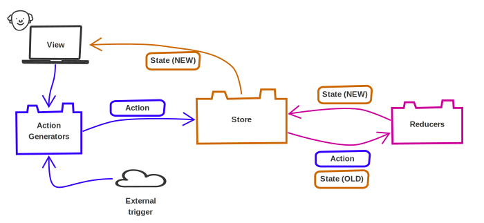

title: React Patterns
subtitle: Hand in Hand With the Basic Framework
class: animation-fade
layout: true

<!-- This slide will serve as the base layout for all your slides -->

.bottom-bar[
{{title}}
]

---

class: impact

# {{title}}

## {{subtitle}}

.title-oli[
Oliver Sturm &bull; @olivers &bull; oliver@oliversturm.com
]

.title-logo[

]

---

## Oliver Sturm

- Training Director at DevExpress
- Consultant, trainer, author, software architect and developer for over 25 years

- Contact: oliver@oliversturm.com

---

## Agenda

- Common Libraries Not Covered By This Talk
- Redux
- Routing
- Handling Side Effects

---

## Common Libraries Not Covered By This Talk

- UI: [Material-UI](https://material-ui.com/), [reactstrap](https://reactstrap.github.io/) and many other free and commercial offerings
- Dealing with styles: [styled-components](https://github.com/styled-components/styled-components) or [CSS Modules](https://github.com/css-modules/css-modules)
- Framework: [Relay](https://github.com/facebook/relay), [Apollo Client](https://github.com/apollographql/apollo-client) for GraphQL, [Gatsby](https://www.gatsbyjs.org/) for complete apps
- Utility: [Lodash](https://lodash.com/), [Ramda](http://ramdajs.com/), [axios](https://github.com/axios/axios)
- Outdated: [recompose](https://github.com/acdlite/recompose)

---

# Redux

.svg[

]

---

## I Like Redux

- The pattern has turned out to be _extremely powerful_
- Promotes _good structure_
  - ... which results in _maintainability_
- People complain about boilerplate
  - They're doing it wrong
- People complain about the learning curve
  - Oh well... it's really not that bad. Agreed: being a good programmer has a learning curve.
- Ideas are being _adopted elsewhere_, e.g. React Hooks ([useReducer](https://reactjs.org/docs/hooks-reference.html#usereducer)), [reactn](https://github.com/CharlesStover/reactn) (global state management)

---

class: impact

# DEMO

---

## Routing

- You know - how to map URLs to parts of your app

  - `/user/:id`

- The Big Ugly: [React Router](https://reacttraining.com/react-router)
  - Very powerful and flexible
  - Component based
- Alternative: _Routing as an aspect of State_
  - My favorite: [Rudy](https://github.com/respond-framework/rudy), successor to [redux-first-router](https://github.com/faceyspacey/redux-first-router)

---

class: impact

# DEMO

---

## Sources

- This presentation:

  - https://oliversturm.github.io/react-patterns
  - PDF download: https://oliversturm.github.io/react-patterns/slides.pdf

- Demo code:

  - https://github.com/oliversturm/react-patterns

---

class: impact

# Thank You

Please feel free to contact me about the content anytime.

.title-oli[
Oliver Sturm &bull; @olivers &bull; oliver@oliversturm.com
]

.title-logo[

]
